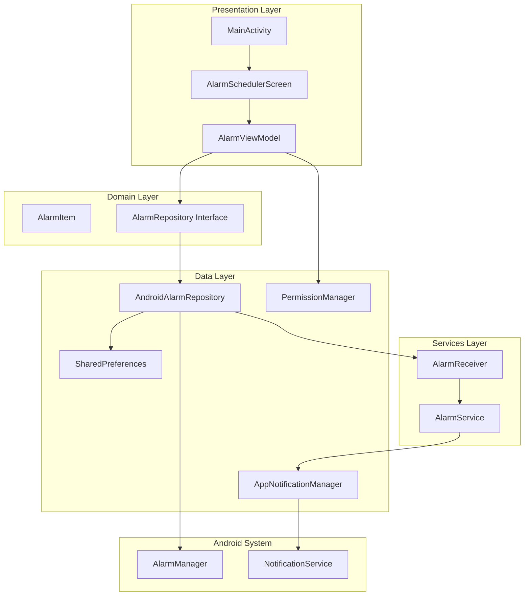
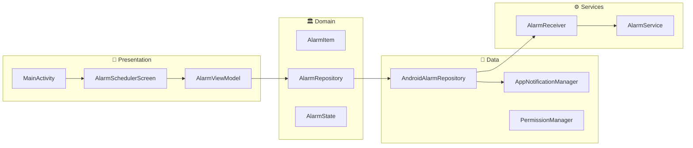
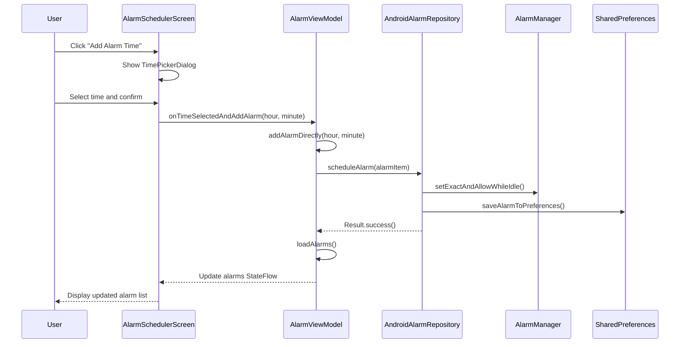
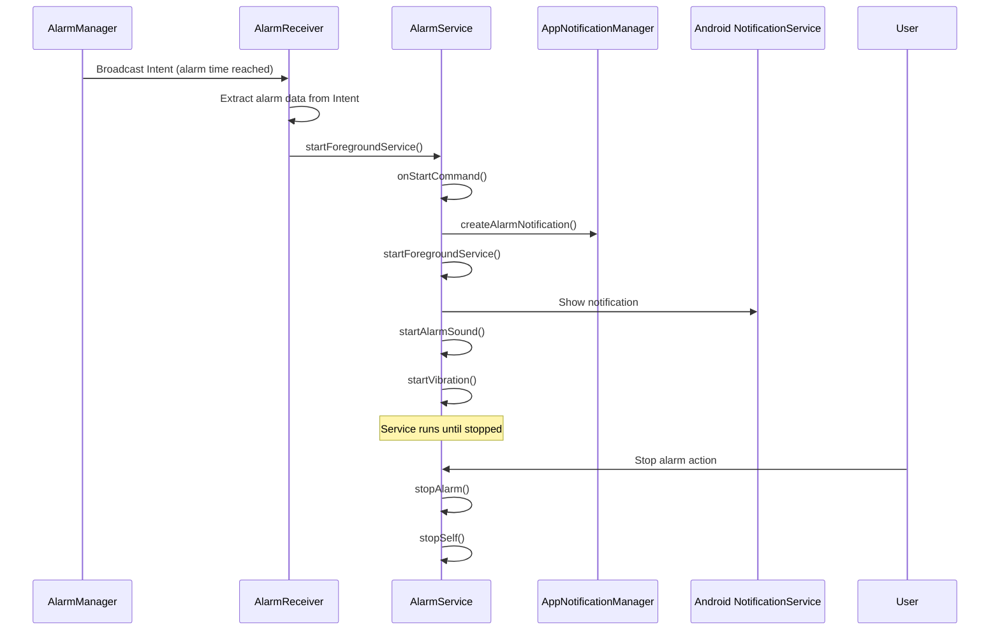
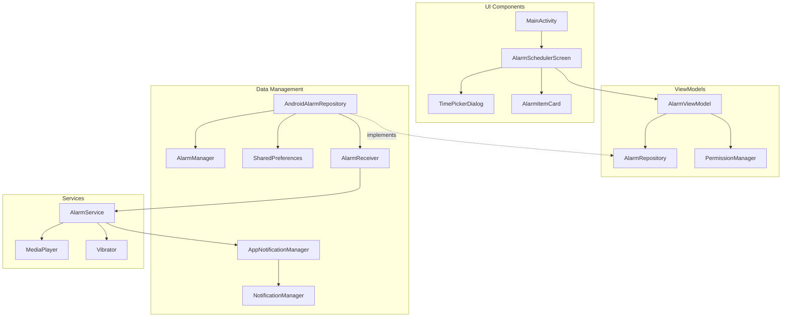
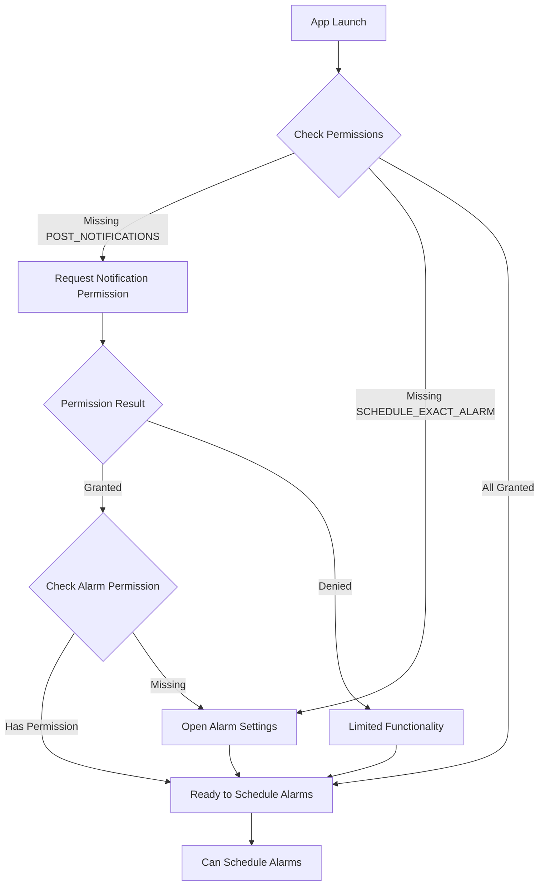
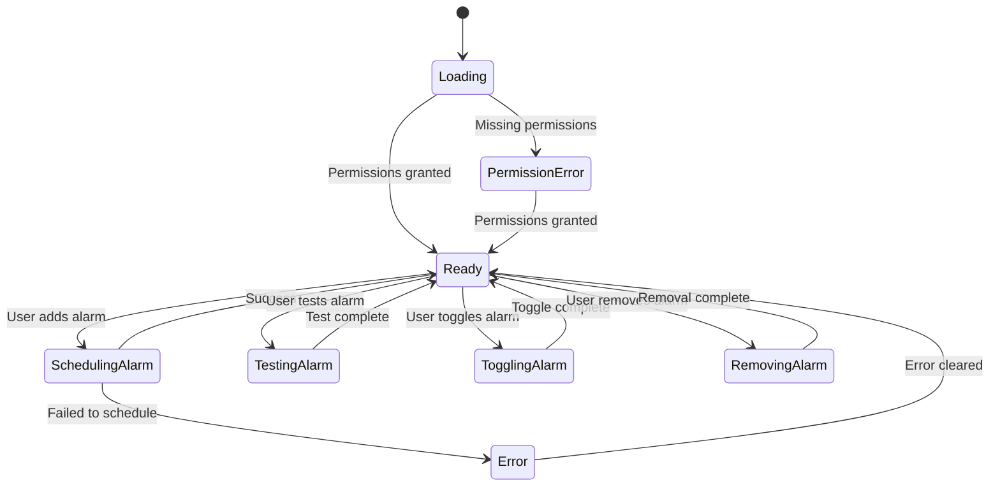
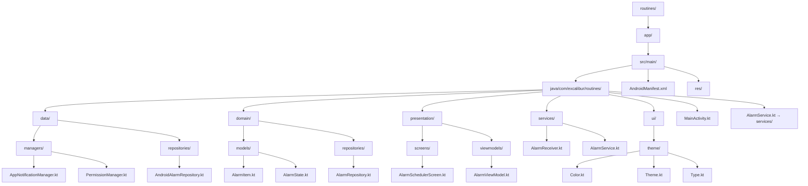

# Routines App Architecture

This document provides a visual overview of the Routines Android application architecture using Mermaid diagrams.

## Overall Architecture

## Clean Architecture Layers

## Data Flow - Adding an Alarm

## Data Flow - Alarm Execution

## Component Dependencies

## Permission Flow

## State Management

## File Structure

## Key Design Patterns

### 1. **Clean Architecture**
- **Presentation Layer**: UI components and ViewModels
- **Domain Layer**: Business logic and entities
- **Data Layer**: Repository implementations and data sources

### 2. **MVVM Pattern**
- **Model**: AlarmItem, AlarmState
- **View**: Compose UI screens
- **ViewModel**: AlarmViewModel with StateFlow for reactive UI

### 3. **Repository Pattern**
- Abstract AlarmRepository interface in domain layer
- AndroidAlarmRepository implementation in data layer
- Enables easy testing and platform independence

### 4. **Observer Pattern**
- StateFlow for reactive state management
- UI automatically updates when data changes
- Unidirectional data flow

### 5. **Dependency Injection**
- Manual DI through constructor injection
- Clear separation of concerns
- Easy to test and maintain